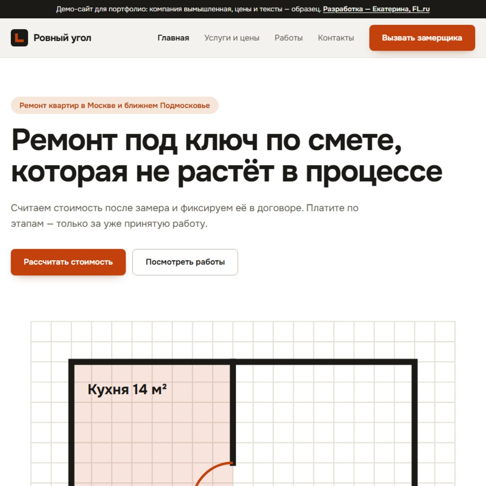

# Ровный угол — ремонт квартир под ключ в Москве

Демо-сайт для портфолио. Компания вымышленная, цены и тексты — образец, заявки с формы никуда не отправляются.

**Живая версия:** https://baibakova2005-art.github.io/demo-remont/



Полные снимки страницы: [компьютер](screenshots/kompyuter.jpg) · [телефон 360 px](screenshots/telefon.jpg)

Ремонт квартир по фиксированной смете: калькулятор стоимости, оплата по этапам, гарантия 3 года.

## Стек

React 19, Vite 8, Tailwind CSS 4. Шрифты подключены локально через Fontsource, картинки нарисованы кодом (SVG), без стоковых фото.

## Что проверено

- мобильная версия на ширине 360 px — без горизонтальной прокрутки;
- форма: обязательная непредзаполненная галочка согласия, ссылки на политику и согласие;
- страницы политики обработки данных, согласия и пользовательского соглашения;
- `noindex` — демо не попадает в поиск.

## Запуск

```bash
npm install
npm run dev
```

Сборка: `npm run build`, готовый сайт — в папке `dist`.

Разработка — Екатерина, [FL.ru](https://www.fl.ru/users/baibakova2005/).
